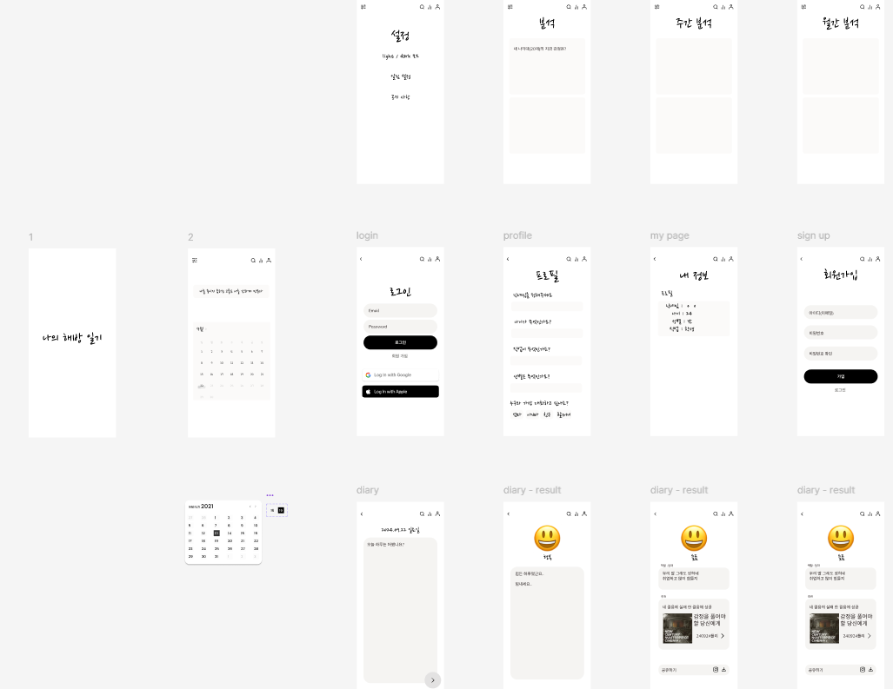

## 1. Introduction
As the culture of comparing with others spreads due to the spread of SNS, and the prevalence intensifies,    
Developed an emotion diary platform, a closed SNS, to reduce the side effects of SNS

&nbsp;

## 2. Table of Contents
- [Project Overview](#프로젝트-개요)
- [Tech Stack](#기술-스택)
- [Key Features](#주요-기능)
- [Troubleshooting](#문제-해결)
- [Future plans](#향후-계획)
- [reference materials](#참고-자료)

&nbsp;

## 3. Project Overview
This project is intended to be used through the **Application**    
to help people with pre-existing conditions **It provides closed SNS**.

&nbsp;

## 4. Tech Stack
- **Front end**: React (TypeScript), Expo
- **Back end**: Nest.js
- **Database**: PostgreSQL
- **etc**: Docker, Jenkins ...

&nbsp;

## 5. Key Features

- **Sign up and log in to membership**
- **Writing and analyzing diaries**
- **Provides emotional analysis and advice using Kobert and LLM**
- **Weekly/Monthly Report**

&nbsp;

## 6. Troubleshooting
- LLM response is very slow, securing GPU servers and solving them with **model quantization**

&nbsp;

## 7. Future plans
Continuous Kobert and LLM fine tuning and UI/UX improvements ... 

&nbsp;

## 8. reference materials
- [ERD](https://www.erdcloud.com/d/D32QknBQnHz4nqA3X)
