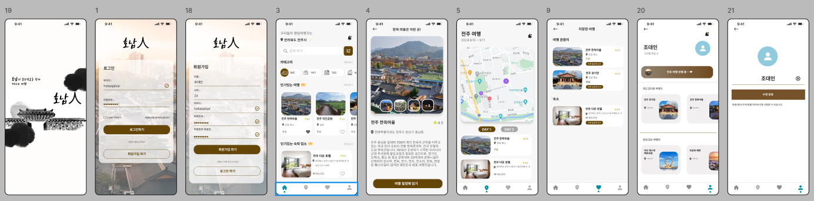

## 1. Introduction
A Dart Improvisational Travel Platform for the Revival of the Tourism Industry in Honam Region

&nbsp;

## 2. Table of Contents
- [Project Overview](#프로젝트-개요)
- [Tech Stack](#기술-스택)
- [Key Features](#주요-기능)
- [Troubleshooting](#문제-해결)
- [Future plans](#향후-계획)
- [reference materials](#참고-자료)

&nbsp;

## 3. Project Overview
The project is based on **Dart Improvisational Travel** popular on SNS through **Application**,   
**It provides an impromptu travel platform**.

&nbsp;

## 4. Tech Stack
- **Front end**: Android Studio. Kotlin
- **Back end**: Kotlin
- **Database**: MariaDB
- **etc**: Tour api  ...

&nbsp;

## 5. Key Features

- **Sign up and log in to membership**
- **a dart game for the selection of an impromptu destination**
- **Recommend tourist attractions and tourist courses near the selected area**
- **Save and manage private tour courses**

&nbsp;

## 6. Troubleshooting
- In some cases, the dart drop point is not located on land, so the radius at the dart drop point is specified

&nbsp;

## 7. Future plans
.... 

&nbsp;

## 8. reference materials
- [ERD](https://dbdiagram.io/d/66a732f78b4bb5230e986d77)
- [Project Diagram](https://www.figma.com/board/OWtpw5ez4CtKvnez2dylbN/Project-Diagram?node-id=0-1&node-type=canvas&t=3efmM45uYONL8Ann-0)
