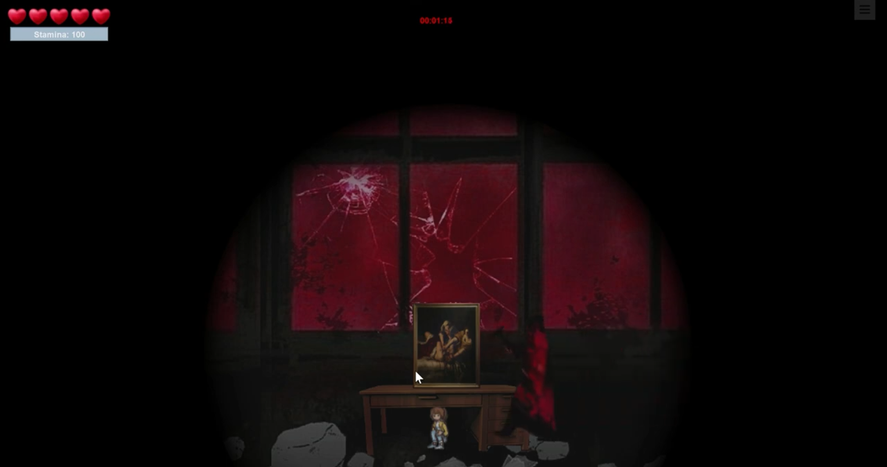

## 1. Introduction
Story horror game played against the backdrop of Jeonbuk National University

&nbsp;

## 2. Table of Contents
- [Project Overview](#프로젝트-개요)
- [Tech Stack](#기술-스택)
- [Key Features](#주요-기능)
- [Troubleshooting](#문제-해결)
- [Future plans](#향후-계획)
- [reference materials](#참고-자료)

&nbsp;

## 3. Project Overview
The project will allow you to tour **Games** indirectly inside the school,    
**It provides interest to the user by adding a fear element**.

&nbsp;

## 4. Tech Stack
- **Front end**: Java
- **Back end**: Java
- **Database**: Local

&nbsp;

## 5. Key Features

- **an exciting story**
- **3 interesting mini-games**
- **a picture with a real school in the background**

&nbsp;

## 6. Troubleshooting
- The speed of the person coming in is too fast. Slow down and control the level of difficulty

&nbsp;

## 7. Future plans
.... 

&nbsp;

## 8. reference materials
- [Video](https://www.youtube.com/watch?v=d9ochLvmVBs)
