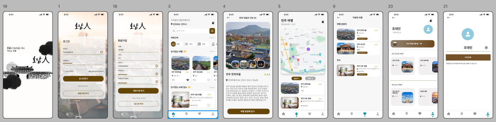

## 1. 소개
호남지역의 관광 산업 부흥을 위한 다트 즉흥 여행 플랫폼

&nbsp;

## 2. 목차
- [프로젝트 개요](#프로젝트-개요)
- [기술 스택](#기술-스택)
- [주요 기능](#주요-기능)
- [문제 해결](#문제-해결)
- [향후 계획](#향후-계획)
- [참고 자료](#참고-자료)

&nbsp;

## 3. 프로젝트 개요
이 프로젝트는 **애플리케이션**을 통해 SNS에서 인기있는 **다트 즉흥 여행**을 기반으로,   
**즉흥 여행 플랫폼**을 제공한다.

&nbsp;

## 4. 기술 스택
- **프론트엔드**: Android Studio. Kotlin
- **백엔드**: Kotlin
- **데이터베이스**: MariaDB
- **기타**: Tour api  ...
&nbsp;

## 5. 주요 기능

- **회원 가입 및 로그인**
- **즉흥 여행지 선정을 위한 다트 게임**
- **선정 지역 근처의 관광지 및 관광 코스 추천**
- **개인 관광 코스 저장 및 관리**

&nbsp;

## 6. 문제 해결
- 다트 낙하 지점의 위치가 육지가 아닌 경우가 발생하여, 다트 낙하 지점에서의 반경을 지정

&nbsp;

## 7. 향후 계획
.... 

&nbsp;

## 8. 참고 자료
- [ERD](https://dbdiagram.io/d/66a732f78b4bb5230e986d77)
- [Project Diagram](https://www.figma.com/board/OWtpw5ez4CtKvnez2dylbN/Project-Diagram?node-id=0-1&node-type=canvas&t=3efmM45uYONL8Ann-0)
