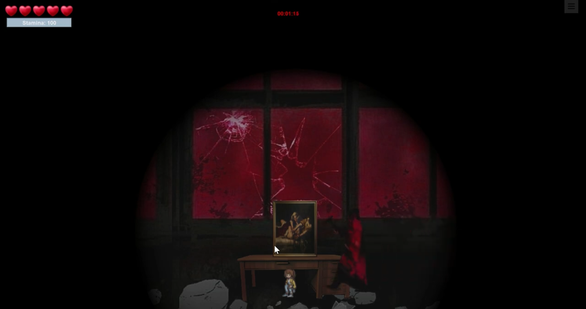

## 1. 소개
전북대를 배경으로 진행되는 스토리 공포게임

&nbsp;

## 2. 목차
- [프로젝트 개요](#프로젝트-개요)
- [기술 스택](#기술-스택)
- [주요 기능](#주요-기능)
- [문제 해결](#문제-해결)
- [향후 계획](#향후-계획)
- [참고 자료](#참고-자료)

&nbsp;

## 3. 프로젝트 개요
이 프로젝트는 **게임**을 학교 내부를 간접적으로 둘러볼 수 있게 하며,   
**공포 요소**를 첨가하여 사용자에게 흥미를 제공한다.

&nbsp;

## 4. 기술 스택
- **프론트엔드**: Java
- **백엔드**: Java
- **데이터베이스**: Local

&nbsp;

## 5. 주요 기능

- **흥미진진한 스토리**
- **3가지의 흥미로운 미니게임**
- **실제 학교를 배경으로 한 사진**

&nbsp;

## 6. 문제 해결
- 쫒아오는 사람의 속도가 너무 빨라 속도를 늦춰 난이도 조절

&nbsp;

## 7. 향후 계획
.... 

&nbsp;

## 8. 참고 자료
- [시연 영상](https://www.youtube.com/watch?v=d9ochLvmVBs)
